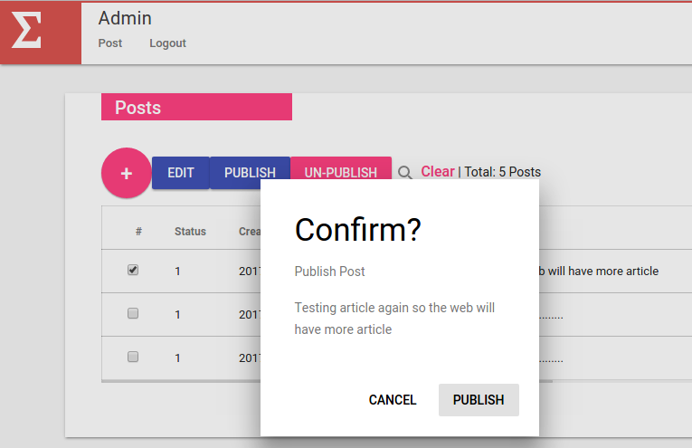
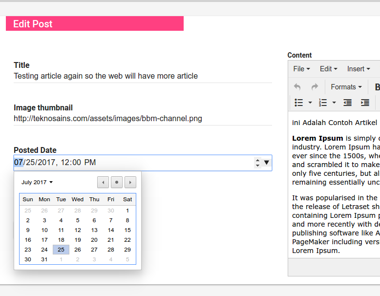
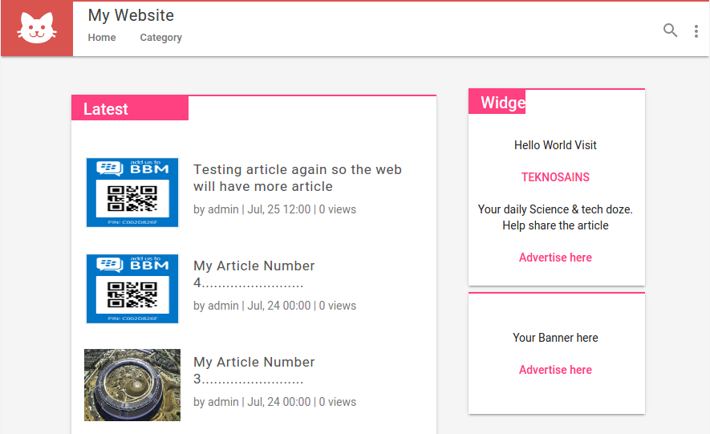

*******************
What is this about ?
*******************

This is an example of how to make Web with Codeigniter with some optimizations
technique including Layouting, Folder Structuring, HMVC, Assets management,
File (HTML, JS, CSS) minification to make the Web load faster.

*******************
Server Requirements
*******************

PHP version 5.6 or newer is recommended.

It should work on 5.3.7 as well, but we strongly advise you NOT to run
such old versions of PHP, because of potential security and performance
issues, as well as missing features.

I recommend you to try PHP 7 and Nginx.

Web Server : Apache or Nginx

************
Installation
************

Just Download to your local and run. Make some adjustment for the Database or
your server config (Apache htaccess or Nginx).

Create a Database ``ci_amp`` and import the ``ci_amp.sql``

Run the web on your browser. For admin page navigate to

http://localhost:/backend

Login : admin / admin

************
Tutorial
************

[indonesia version] : [Tutorial: Optimasi Web Codeigniter 3 - Part2](http://teknosains.com/php/tutorial-optimasi-web-codeigniter-3-part-2)

[english version] : incoming...
*******************
Screenshoots
*******************

